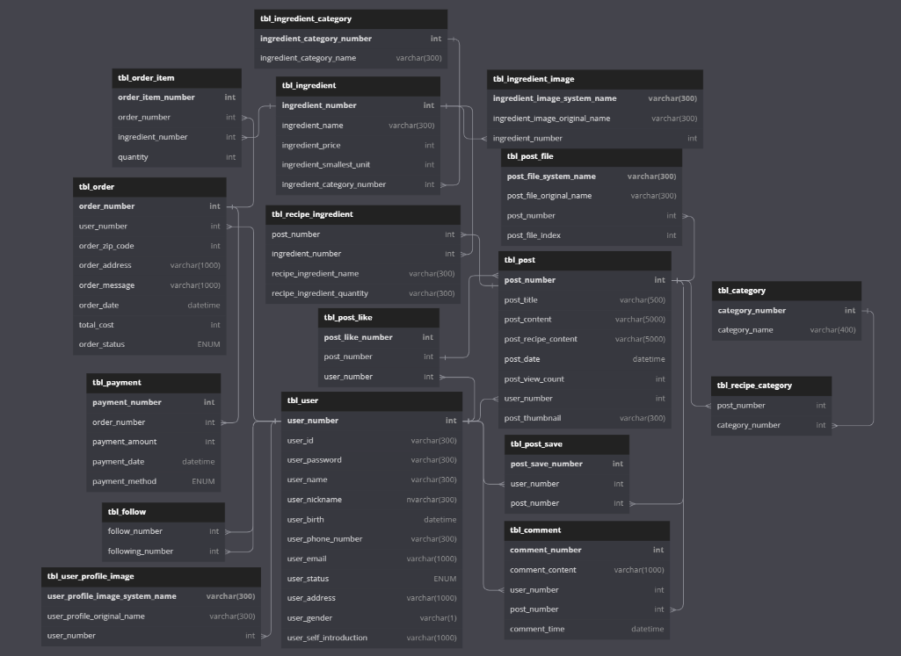

# 팀명 : yumyumgood
# 프로젝트 이름 : cookpang
## 팀 구성

|팀장|이동재|           
|:--:|:--:|
|부팀장|김대연|
|팀원|강승연|
|팀원|박은서|
|팀원|송지호|

## 프로젝트 주제 

1. ###  sns컨셉으로 사용자가 자신의 레시피를 공유하고 다른사람들의 레시피도 찾아 볼 수 있는 사이트
2. ###  레시피에 필요한 재료들을 구매 할 수 있는 사이트

## ERD구성

⚙️ 개발 환경

java 11   
IDE : Eclipse  
Database : Oracle DB(11xe)  
Framework : MyBatis  
Web : Apach Tomcat  

📌 주요 기능  
로그인  
● DB값 검증  
● ID찾기, PW찾기  
● 로그인 시 쿠키(Cookie) 및 세션(Session) 생성  

회원가입  
● ID 중복 체크  
● 비밀번호 유효성 검사  
● DB에 값 저장  

장바구니 및 결제페이지  
● 장바구니 재료 선택  
● 선택한 재료 총 결제 금액 알려주기  

메인페이지  
● 등록 게시물  
● 게시물 선택  
● 카테고리 별 게시물 선택  
● 랭킹 별 게시물 보여주기  

마이페이지  
● 찜한 게시물, 장바구니 게시물  
● 게시물 작성하기  
● 프로필,기본정보 편집  
● 구매내역 조회  

유저페이지 
● 팔로일 , 팔로우, 게시글  

관리자 페이지 
● 관리자 로그인  
● 회원관리, 게시글 관리, 결제 관리 
● 일 별 매출 차트, 게시글 조회수 차트  

